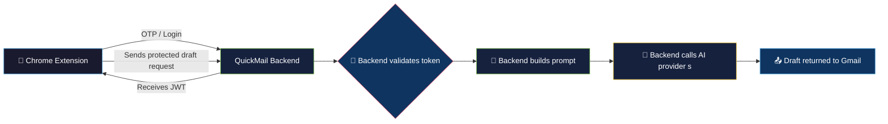
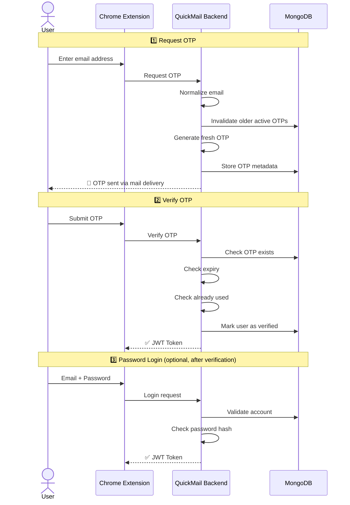
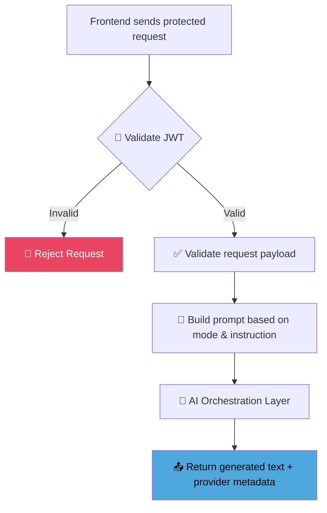
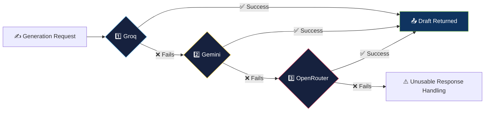

<div align="center">


<br/>


<br/>

[](https://github.com/bikashcode-dev/QuickMail/stargazers)
[](https://github.com/bikashcode-dev/QuickMail/forks)
[](https://github.com/bikashcode-dev/QuickMail/commits)

</div>

QuickMail Backend is the Spring Boot API behind the QuickMail Gmail extension. It handles authentication, OTP verification, JWT-protected access, AI email draft generation, and provider fallback.

This project is designed as a **production-style backend for a real user workflow**.

---

## 📌 Table of Contents

- [Highlights](#-highlights)
- [What The Backend Does](#-what-the-backend-does)
- [High-Level Flow](#-high-level-flow)
- [Authentication Flow](#-authentication-flow)
- [Email Generation Flow](#️-email-generation-flow)
- [AI Fallback Strategy](#-ai-fallback-strategy)
- [Security Approach](#-security-approach)
- [Tech Stack](#️-tech-stack)
- [Project Structure](#-project-structure)
- [Running Locally](#-running-locally)
- [Deployment Notes](#-deployment-notes)
- [Why This Project Matters](#-why-this-project-matters)
- [Future Improvements](#-future-improvements)

---

## ✨ Highlights

<table>
<tr>
<td width="50%" valign="top">

- ☕ Spring Boot 3 + Java 17
- 🔐 Spring Security with stateless JWT authentication
- 📩 OTP-based account verification
- 🍃 MongoDB persistence

</td>
<td width="50%" valign="top">

- 🤖 AI email generation with fallback strategy
- 🚂 Railway-ready deployment setup
- 🧩 Chrome extension integration

</td>
</tr>
</table>

---

## 🛠 What The Backend Does

| Responsibility | Description |
|---|---|
| 📨 OTP Delivery | Sending OTPs for email verification |
| ✅ OTP Verification | Verifying OTPs and activating accounts |
| 🔑 Password Login | Allowing password-based login after verification |
| 🪪 Token Issuance | Issuing JWT tokens for protected API access |
| ✍️ Draft Requests | Receiving email drafting requests from the frontend |
| 🧱 Prompt Building | Building safe, structured prompts |
| 🔀 AI Routing | Routing generation requests through multiple AI providers |
| 📤 Response Delivery | Returning generated email content to the extension |

---

## 🔄 High-Level Flow



---

## 🔐 Authentication Flow



---

## ✍️ Email Generation Flow



---

## 🤖 AI Fallback Strategy

The system is designed so **one provider failure does not stop the product**.



If one provider fails or returns an unusable response, the backend automatically tries the next provider in order: **Groq → Gemini → OpenRouter**.

---

## 🔒 Security Approach

- ✅ Stateless authentication with JWT
- ✅ Protected API routes
- ✅ BCrypt password hashing
- ✅ OTP invalidation and expiry checks
- ✅ Request validation before generation

---

## ⚙️ Tech Stack

<div align="center">


</div>

---

## 📁 Project Structure

```text
src/main/java/com/email/emailgen
├── config
├── controller
├── dto
├── exception
├── model
├── repository
├── security
├── service
│   ├── auth
│   ├── impl
│   └── orchestrator
└── EmailgenApplication.java
```

---

## ▶️ Running Locally

```powershell
cmd /c "call mvnw.cmd spring-boot:run"
```

---

## 🚀 Deployment Notes

- 🚂 The backend is structured for deployment on **Railway** and **Render**
- 🔧 Production configuration should come from **environment variables**
- 🚫 Local-only secrets should never be committed
- 🔐 Protected routes depend on valid **JWT tokens**

---

## 🌟 Why This Project Matters

| Capability | Demonstrates |
|---|---|
| 🔐 Real authentication flow | End-to-end OTP + JWT implementation |
| 🛡️ Secure API design | Validation, hashing, token protection |
| 🔗 Frontend-backend integration | Chrome extension ↔ Spring Boot API |
| 🤖 AI orchestration | Multi-provider prompt routing |
| 🔀 Fallback handling | Resilient system design |
| 🚂 Production-style deployment thinking | Environment-driven config, Railway/Render ready |

---

## 🔮 Future Improvements

- [ ] Per-user usage tracking
- [ ] Better observability and metrics
- [ ] Refresh-token strategy
- [ ] Async processing for higher traffic
- [ ] Richer prompt/history management

---

<div align="center">


</div>
